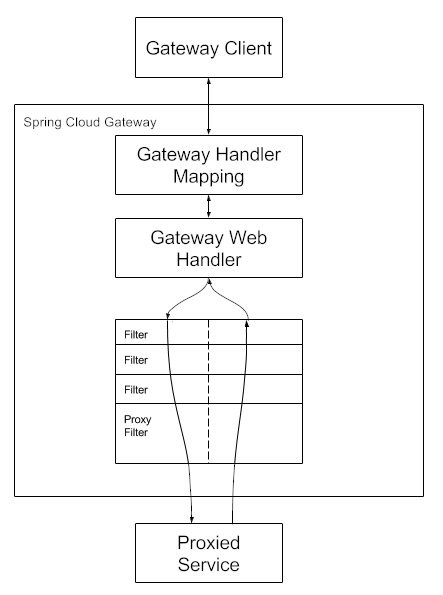

## Spring Gateway 의 작동 방식에 대한 개략적인 흐름


1. `클라이언트`는 Spring Cloud Gateway 에 요청을 보낸다.
2. `Gateway Handler Mapping` 에서 요청이 경로와 일치할 경우 -> `Gateway Web Handler` 전송
3. 이 핸들러는 요청에 특화된 필터 체인을 통해 요청을 실행
   
---
## Route Predicate Factories

- `Spring Cloud Gateway` 에는 다양한 내장 라우트 `프리디케이트(predicate)` 팩토리가 포함되어 있다.
- 각각은 `HTTP` 요청의 서로 다른 속성을 기준으로 매칭을 수행한다.
- 여러 라우트 프리디케이트 팩토리를 논리적 `AND` 연산으로 결합하여 사용할 수도 있다.


### After 
```yaml
spring:
  cloud:
    gateway:
      routes:
      - id: after_route
        uri: https://example.org
        predicates:
        - After=2017-01-20T17:42:47.789-07:00[America/Denver]
```
- `After` : 지정한 날짜와 시간 이후에 발생하는 요청과 매칭된다. 


### Before 
```yaml
spring:
  cloud:
    gateway:
      routes:
      - id: before_route
        uri: https://example.org
        predicates:
        - Before=2017-01-20T17:42:47.789-07:00[America/Denver]
```
- `Before` : 지정한 날짜와 시간 이전에 발생하는 요청과 매칭된다. 


### Between 
```yaml
spring:
  cloud:
    gateway:
      routes:
      - id: between_route
        uri: https://example.org
        predicates:
        - Between=2017-01-20T17:42:47.789-07:00[America/Denver], 2017-01-21T17:42:47.789-07:00[America/Denver]
```
- `Between` : 2개의 매개변수를 받아 지정한 날짜 사이에 발생하는 요청과 매칭된다.


### Cookie
```yaml
spring:
  cloud:
    gateway:
      routes:
      - id: cookie_route
        uri: https://example.org
        predicates:
        - Cookie=chocolate, ch.p
```
- `Cookie` : `쿠키명`, 과 `Java 정규 표현식` 두 개의 매개변수를 받는다.
주어진 `쿠키명`을 가지고 그 값이 `정규 표현식`과 일치하는 쿠키를 매칭한다.


### Header
```yaml
spring:
  cloud:
    gateway:
      routes:
      - id: header_route
        uri: https://example.org
        predicates:
        - Header=X-Request-Id, \d+
```
- `Header` : `헤더명` 와 `Java 정규 표현식` 두개의 매개변수를 받는다.
이 헤더는 `X-Request-Id` 와 일치하는 값을 갖는 헤더가 있는 경우 `\d+`(하나 이상의 숫자 값을 갖는 경우) 일치하는 헤더를 매칭


### Host
```yaml
spring:
  cloud:
    gateway:
      routes:
      - id: host_route
        uri: https://example.org
        predicates:
        - Host=**.somehost.org,**.anotherhost.org
```
- `Host` :  호스트 명 리스트 매개변수를 받으며, `Host` 헤더가 해당 패턴과 일치하는 요청을 매칭
  (ex: `www.somehost.org`, `beta.somehost.org`, `www.anotherhost.org`) 중 하나라면 이 라우트와 매칭)


### Method
```yaml
spring:
  cloud:
    gateway:
      routes:
      - id: method_route
        uri: https://example.org
        predicates:
        - Method=GET,POST
```
- `Method` : 하나 이상의 매개변수를(`GET`, `POST` 등등) 받는다.


### Path
```yaml
spring:
  cloud:
    gateway:
      routes:
      - id: path_route
        uri: https://example.org
        predicates:
        - Path=/red/{segment},/blue/{segment}
```

- `Path` : 두 가지 매개변수를 받는다.
  - `Spring PathMatcher` 패턴의 목록
  - 선택적 플래그 `matchTrailingSlash` (기본값: `true)
  
요청 경로가 `/red/1` , `/red/1/`, `/red/blud`, `/blue/green` 같은 경우에 매칭된다.

**만약 선택적 플래그 `matchTrailingSlash` 값을 `false` 로 설정하면, `/red/1/` 은 매칭되지 않는다.**

**또한 `spring.webflux.base-path` 프로퍼티를 설정해두었다면 설정된 값이 자동으로 경로 패턴 앞에 붙는다**

### ex 
`spring.webflux.base-path=/app` 이고 경로 패턴이 `/red/{segment)` 라면,
실제 매칭에서 사용되는 전체 패턴은 `/app/red/{segment}` 가 된다.

`Path` 프리디 케이트는 URI 템플릿 변수를 `이름-값` 쌍의 맵으로 추출하여
`ServerWebExchange.getAttributes()`에 저장한다. (요청 컨텍스트 안에 저장됨)

추가로, 이러한 변수에 더 쉽게 접근할 수 있도록 `get` 유틸리티 메서드 제공
```java
Map<String, String> uriVariables = ServerWebExchangeUtils.getUriTemplateVariables(exchange);
String segment = uriVariables.get("segment");

```

### 어디에 쓰지?
**나중에 `GatewayFilter` 를 직접 구현하거나 `동적 라우팅`을 해야 할 때 추출하여 알맞게 사용**

---

### Query
```yaml
spring:
  cloud:
    gateway:
      routes:
      - id: query_route
        uri: https://example.org
        predicates:
        - Query=green
```
- `Query` : 하나의 필수 매개변수 와 선택 매개변수(Java 정규 표현식) 두 개를 받는다. `green` 쿼리 매개변수가 포함된 경우에 매칭된다.

```yaml
spring:
  cloud:
    gateway:
      routes:
      - id: query_route
        uri: https://example.org
        predicates:
        - Query=red, gree.
```
- 쿼리 파라미터 이름이 `red` 이고 정규식이 `gree.` 에 매칭되면 통과
- `/path?red=green` ✅
- `/path?red=greeX` ✅
- `/path?red=gree`  ❌ (뒤에 한 글자가 없어서 안됨) 

---

### RemoteAddr
```yaml
spring:
  cloud:
    gateway:
      routes:
      - id: remoteaddr_route
        uri: https://example.org
        predicates:
        - RemoteAddr=192.168.1.1/24
```
- `RemoteAddr` : `CIDR 표기법(IPv4/IPv6)` 문자열인 목록을 받는다.

---

### Weight 
```yaml
spring:
  cloud:
    gateway:
      routes:
      - id: weight_high
        uri: https://weighthigh.org
        predicates:
        - Weight=group1, 8
      - id: weight_low
        uri: https://weightlow.org
        predicates:
        - Weight=group1, 2
```
- `Weight` : 두개의 인수(`group`, `weight`)를 받는다.

**(`weightlow.org` 로 트래픽의 약 20% 를 `weighthigh.org` 로 트래픽의 약 80%를 전달.)**

---

### XForwardedRemoteAddr
```yaml
spring:
  cloud:
    gateway:
      routes:
      - id: xforwarded_remoteaddr_route
        uri: https://example.org
        predicates:
        - XForwardedRemoteAddr=192.168.1.1/24
```
- `XForwardedRemoteAddr` : `CIDR 표기법(IPv4/IPv6)` 문자열 값을 받는다.

- **이 요청이 어떤 IP 대역에서 왔는지 확인해서, 조건에 맞는 경우만 통과시켜라** 라는 설정
- 확인의 기준은 `X-Forwarede-For` 라는 값
- **즉, 게이트웨이가 프록시 뒤에 있을 때도 실제 사용자 IP 를 보고 허용/차단** 할 수 있게 해준다.

---

### RemoteAddr vs XForwardedRemoteAddr 비교
| 구분        | RemoteAddr                                      | XForwardedRemoteAddr                                                  |
| --------- | ----------------------------------------------- | --------------------------------------------------------------------- |
| **판단 기준** | 실제 TCP 연결의 원격 주소 (`request.getRemoteAddress()`) | HTTP `X-Forwarded-For` 헤더 값                                           |
| **사용 시점** | 게이트웨이가 **직접 클라이언트와 통신**할 때 (공인 IP로 바로 노출된 경우)   | 게이트웨이가 **프록시/로드밸런서 뒤에 있을 때** (실제 클라이언트 IP를 알기 위해)                     |
| **장점**    | 단순하고 조작 위험 없음                                   | 프록시 환경에서도 클라이언트 실제 IP 확인 가능                                           |
| **단점**    | 프록시 뒤에 있으면 "프록시 IP"만 보여서 클라이언트 식별 불가            | 헤더 조작 위험 → 반드시 신뢰할 수 있는 프록시에서만 사용해야 함                                 |
| **예시**    | `/path? ...` 들어왔을 때 클라이언트 IP가 곧 `RemoteAddr`    | `X-Forwarded-For: 203.0.113.5, 192.168.0.10` 같은 값에서 203.0.113.5 등을 추출 |
